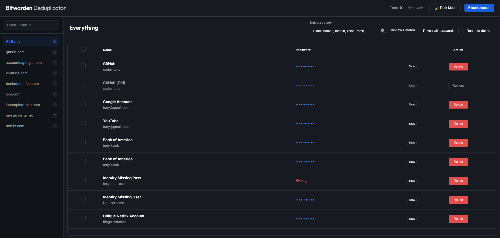
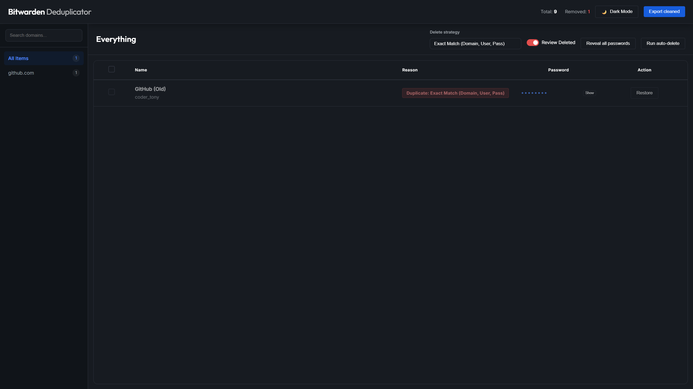
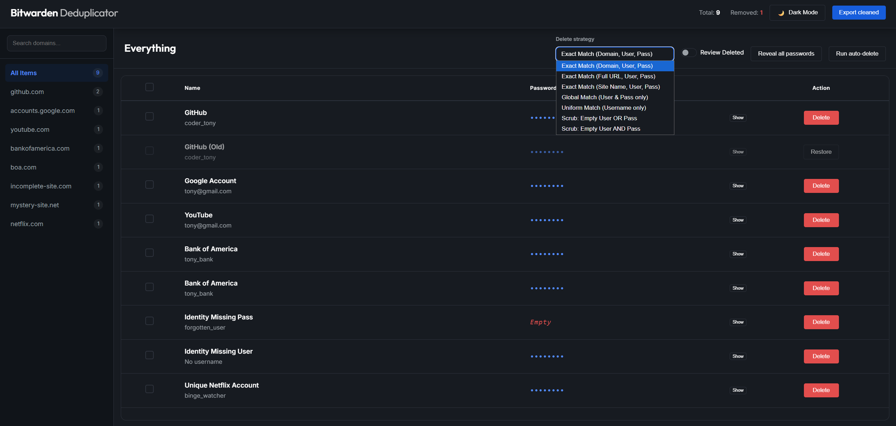
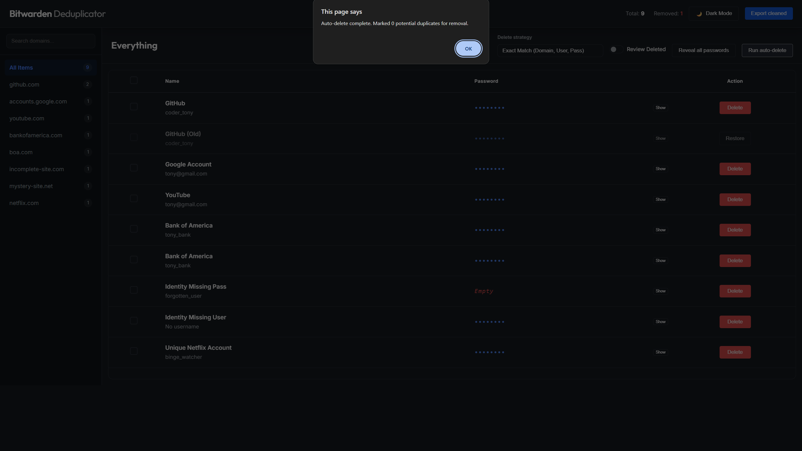

# Bitwarden Deduplicator

A high-performance, secure, and modern web-based tool for cleaning up duplicate entries in your Bitwarden vault. This tool runs entirely in your browser—your sensitive data never leaves your computer. Specifically rebranded to match the official **Bitwarden Web Vault** aesthetic.

**[Try the Live Version Here](https://bcalmkid.github.io/Bitwarden-Dedupe-Tool/dedupe.html)**

## 🚀 Key Features

-   **Zero-Knowledge Privacy**: No server-side processing. All JSON parsing and deduplication happen locally in your browser.
-   **Official Bitwarden Aesthetic**: A premium interface that mirrors the official web vault, including deep navy/gray palettes and professional typography.
-   **Intelligent Scrubbing**: Choose from 7 different "Delete Strategies" to find duplicates or incomplete entries based on your specific needs.
-   **Unified View**: Site names and identities are combined into a single, clean column for better readability.
-   **Dynamic Themes**: Toggle between Dark and Light modes with persistent settings saved to your browser.
-   **Bulk Management**: Powerful selection bar for batch deletes or restores with prioritized primary actions.
-   **Domain Grouping & Search**: Automatically groups vault items by domain and provides a real-time search for quick navigation.
-   **Performance Optimized**: Handles vaults with thousands of entries smoothly using localized DOM updates and efficient filtering.
-   **Review Mode**: A dedicated "Review Deleted" toggle that filters the vault to show ONLY marked items, complete with a "Reason" column explaining each deletion.
-   **Credential Safety**: Passwords are masked and styled for clarity (e.g., "Empty" indicators for missing data). Supports individual or global reveal.

## 📸 Interface

### 🖥️ Main Dashboard
Overview of the vault grouped by domain with real-time stats and theme controls.

### 🔍 Review Mode
Audit deleted items with a dedicated "Reason" column and filtered sidebar navigation.

### ⚙️ Delete Strategies
Multiple matching algorithms to catch everything from exact duplicates to junk entries.

### 🤖 Automation Logic
Instant feedback on auto-deletion counts and secure password masking.

## 🛠️ Delete Strategies

The tool provides granular control over how duplicates and incomplete items are identified:

| Strategy | Description |
| :--- | :--- |
| **Exact Match (Domain, User, Pass)** | Matches entries with the same base domain (e.g., github.com) and credentials. (Default) |
| **Exact Match (Full URL, User, Pass)** | Precise matching based on the exact URI path. |
| **Exact Match (Site Name, User, Pass)** | Matches based on the display name of the vault item. |
| **Global Match (User & Pass only)** | Finds identical credentials shared across *any* site in your vault. |
| **Uniform Match (Username only)** | Audits all locations where a specific username is used. |
| **Scrub: Empty User OR Pass** | Flags any entries missing either a username or a password for removal. |
| **Scrub: Empty User AND Pass** | Specifically targets "junk" entries where both username and password fields are empty. |

## 📖 How to Use

1.  **Export Your Vault**: In Bitwarden, go to *Tools* > *Export Vault* and select **.json** format.
2.  **Import**: Drag and drop your `.json` file into the Deduplicator or click "Choose File".
3.  **Navigate**: Use the sidebar to browse by domain or the search bar to find specific sites.
4.  **Auto-Delete**: select a strategy from the dropdown and click **Run auto-delete**. This will mark potential duplicates for removal (indicated by a faded row).
5.  **Audit**: Review the marked items. You can manually **Delete** or **Restore** any item. Use "Reveal all passwords" to compare secrets.
6.  **Bulk Action**: Select multiple items using checkboxes to perform batch operations via the top selection bar.
7.  **Export**: Click **Export cleaned** to download your finalized JSON file.
8.  **Import to Bitwarden**: Your cleaned file is ready for import back into Bitwarden. 

## 💻 Tech Stack

-   **Frontend**: Vanilla HTML5, CSS3, and JavaScript (ES6+).
-   **Icons & Style**: CSS-based UI components following Bitwarden's design language.
-   **Typography**: JetBrains Mono for passwords, Inter/Outfit for UI text.
-   **Logic**: Efficient JavaScript filtering and set-based deduplication algorithms.

## 🔒 Security Note

This tool is a completely static application. It does not use any third-party tracking, cookies, or external APIs. Your vault data resides ONLY in your browser's memory and is instantly cleared as soon as you refresh or close the tab.

---
*Clean your vault with confidence and privacy.*
